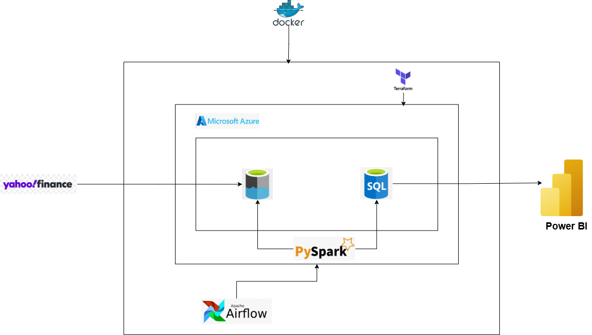

# Stock Data Pipeline

An end-to-end data engineering project that extracts stock data from Yahoo Finance, loads it to Azure Data Lake Storage (ADLS), transforms it with PySpark, and loads it to Azure SQL Server.

## Table of Contents

- [Overview](#overview)
- [Technologies Used](#technologies-used)
- [Setup and Installation](#setup-and-installation)
- [Usage](#usage)
- [License](LICENSE)

## Overview

This project implements a complete ETL (Extract, Transform, Load) pipeline for stock market data. It extracts hourly stock data for major companies, processes it, and stores it in a structured format for analysis. This project assumes you are on Linux or MacOS. 

### Prerequisite

- Optional: Email smtp server 
- Docker desktop, docker compose
- make
   - If you are on Linux/Mac
   - check if you have make installed `make --version`

      ** Mac
      `brew install make`

      ** Linux \
      `sudo apt update` \
      `sudo apt install make`

- Install Azure CLI (Make sure you have an active azure subscription)
   - [Azure CLI](https://learn.microsoft.com/en-us/cli/azure/)
   - [Azure Login](https://learn.microsoft.com/en-us/cli/azure/authenticate-azure-cli-interactively)
- Terraform installed
  - [Download your OS version here](https://developer.hashicorp.com/terraform/install)
- Create a `terraform.tfvars` for sensitive information
Use the following template for ease of use with the `variables.tf` file:

```plaintext
start_client_ip_address = <YOUR_IP_START_RANGE> # curl ipecho.net/plain
end_client_ip_address = <YOUR_IP_END_RANGE>
sql_admin_username = <YOUR_MSSQL_USERNAME>
sql_admin_password = <YOUR_MSSQL_PASSWORD>
resource_group_location = <YOUR_LOCATION> # "East US", "UK West", "North Europe"
```

## Architecture



The pipeline follows this workflow:

1. **Extract** - Fetch company data and stock prices from Yahoo Finance
2. **Load** - Store raw data in Azure Data Lake Storage
3. **Transform** - Process data using PySpark
4. **Load** - Store transformed data in Azure SQL Server with appropriate partitioning

## Technologies Used

- **Python 3.10** - Core programming language
- **Apache Airflow** - Workflow orchestration
- **Selenium** - Web scraping
- **yfinance** - Yahoo Finance API
- **Azure Data Lake Storage** - Cloud storage for raw and processed data
- **Azure Identity** - Authentication with Azure services
- **PySpark** - Distributed data processing
- **Azure SQL Server** - Data warehouse
- **Pandas & PyArrow** - Data manipulation and storage

### Setup and Installation

#### Create a .env file with the following variables (SMTP credentials are optional):

if you don't want to use the email feature, you can remove the env variables from the docker-compose file and skip this step. Also, you have to remove the email operator from the DAG file.

```
SMTP_HOST=smtp.gmail.com
SMTP_PORT=587
SMTP_USER=your_actual_email@gmail.com
SMTP_PASSWORD=your_actual_password
SMTP_MAIL_FROM=your_actual_email@gmail.com
SMTP_STARTTLS=True
SMTP_SSL=False
```

#### Make

##### Make sure you have the necessary tools specified in the prerequisites section

- Run `make tf-apply` to initialize and apply terraform to create the necessary resources in Azure.
  - This will create a resource group, storage account, SQL server, SQL database, and a service principal for authentication.
  - **Note**: The storage account name has to be globally unique, so you may need to change the name in the `main.tf` to something unique before running the command.
- Run `make docker-build` to build the dockerfile airflow base image that will be used in the docker compose file
- Run `airflow-init` to initialize the Airflow database and create the necessary tables.
- Run `make docker-start` to initialize airflow and run the containers in the docker compose file
- Run `make tf-output` to output all required credentials for Airflow connections (Not suitable for production)
   - Create these connections in Airflow UI using the output values from the terminal:
   - Azure Data Lake Storage
      - Conn ID: `az_datalake_conn`
      - Conn Type: `Generic`
      - Host: `ACC_NAME`
      - Password: `ACC_KEY`
      - Extra: `{"container_name": "CONTAINER_NAME"}`
   - Azure SQL Server
      - Conn ID: `az_sql_conn`
      - Conn Type: `Microsoft SQL Server`
      - Host: `SQL_SERVER`
      - Schema: `SQL_DB`
      - Login: `SQL_USER`
      - Password: `SQL_PASSWORD`
   - Azure Service Principal
      - Conn ID: `service_principal_conn`
      - Conn Type: `Generic`
      - Extra: `{"tenant_id": "SP_TENANT_ID", "client_id": "SP_APP_ID", "client_secret": "SP_SECRET_ID"}`
   - Spark
      - Conn ID: `spark_conn`
      - Conn Type: `Spark`
      - Host: `spark://spark-master` (If you get an error, try using the container name; for example - `spark://stockpipeline-spark-master-1`)
      - Port: `7077`

- Run `make docker-stop` to stop the docker compose image
- Run `make tf-destroy` to destroy all resources

## Usage

Once you have completed the setup and installation steps, you can use the pipeline as follows:

### 1. Access Airflow UI

After starting the containers with `make docker-start`, access the Airflow web interface at:

- URL: <http://localhost:8080>
- Username: airflow
- Password: airflow

### 2. Configure Connections

Ensure all the required connections are properly configured in Airflow:

- Azure Data Lake Storage connection (`az_datalake_conn`)
- Azure SQL Server connection (`az_sql_conn`)
- Azure Service Principal connection (`service_principal_conn`)
- Spark connection (`spark_conn`)

### 3. Activate DAGs

DAGs are available in the system:

**ELT DAG** - The pipeline that runs daily at 6:00 PM Eastern Time on weekdays (Monday-Friday)
   - Extracts stock data from Yahoo Finance
   - Loads raw data to Azure Data Lake Storage
   - Transforms data with PySpark
   - Loads processed data to Azure SQL Server

Enable the DAG by toggling them on in the Airflow UI.

### 4. Monitor Pipeline Execution

You can monitor the execution of the pipeline through:

- Airflow UI Dashboard - Shows overall DAG status
- Task Instance Details - Provides logs and execution status for each task
- Email Notifications - If configured, you'll receive emails on task completion or failure

### 5. Access Processed Data

The transformed stock data is available in:

- Azure SQL Server database (`spice-db` or whatever you decide to name it) in the `StockData` table
- Data is partitioned by date for efficient querying

### 6. View Spark UI

To monitor Spark job execution details:

- Access the Spark Master UI at http://localhost:9090
- View active jobs, completed tasks, and resource utilization

### 7. Troubleshooting

If you encounter issues:

1. Check Airflow task logs for detailed error messages
2. Ensure your Azure subscription and resources are active

### 8. Shutting Down

When you're done:
1. Run `make docker-stop` to stop all containers
2. Run `make tf-destroy` if you want to remove all Azure resources